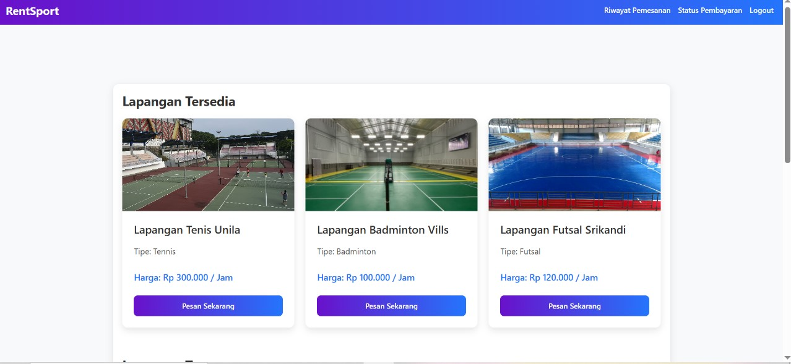
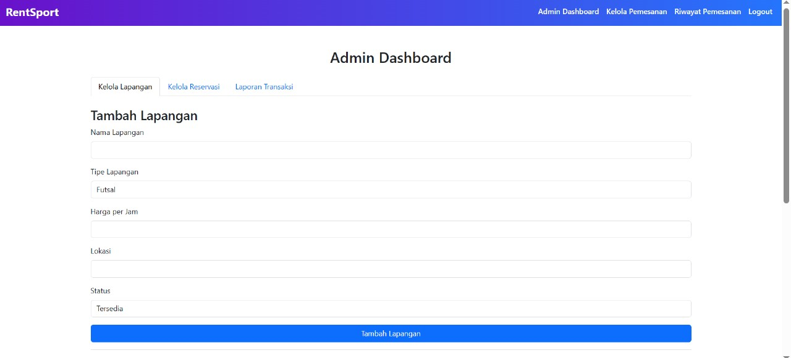

# RentSport - Aplikasi Reservasi Lapangan Olahraga

RentSport adalah sistem berbasis web untuk melakukan reservasi lapangan olahraga. Aplikasi ini dibangun menggunakan PHP dan MySQL serta memanfaatkan fitur-fitur lanjutan pada level database seperti stored procedure, stored function, trigger, transaction, dan backup terjadwal. Tujuan dari sistem ini adalah memberikan pengalaman reservasi yang efisien, andal, dan aman bagi pengguna dan pengelola.

**Dashboard User**


**Dashboard Admin**
 
---

---

## Struktur Tabel Utama

- `users`: Menyimpan informasi pengguna dan administrator.
- `fields`: Data lapangan olahraga (nama, jenis, harga, lokasi, status).
- `reservations`: Menyimpan data pemesanan lapangan.
- `transactions`: Mencatat informasi pembayaran.
- `reviews`: Menyimpan ulasan dan rating pengguna terhadap layanan.

---

## Implementasi Fitur Database

### Stored Procedure

#### ReservasiLapangan

Melakukan pemesanan lapangan dan mengubah status lapangan menjadi "terpesan".

```sql
CALL ReservasiLapangan(p_user_id, p_field_id, p_start_time, p_end_time);
```

Prosedur ini menggunakan blok transaksi (`START TRANSACTION`) agar jika salah satu langkah gagal, proses dapat di-rollback.

#### ConfirmReservation

Digunakan oleh admin untuk mengonfirmasi pemesanan dan memperbarui status pembayaran.

```sql
CALL ConfirmReservation(p_reservation_id);
```

Membantu pengelolaan status pemesanan secara administratif.

---

### Stored Function

#### HitungTotalBiaya

Fungsi untuk menghitung biaya total berdasarkan harga per jam dan durasi sewa lapangan.

```sql
SELECT HitungTotalBiaya(p_field_id, p_jumlah_jam);
```

Logika harga ditempatkan pada level database agar konsisten dan terpusat.

---

### Trigger

#### PembatalanOtomatisReservasi

Secara otomatis membatalkan reservasi dengan status "pending" yang tidak dikonfirmasi dalam waktu 10 menit.

```sql
AFTER INSERT ON reservations
IF TIMESTAMPDIFF(MINUTE, NEW.created_at, NOW()) > 10 THEN
    UPDATE reservations SET status = 'cancelled', cancelled_at = NOW();
```

#### PerbaruiStatusLapanganSetelahPembayaran

Memastikan bahwa lapangan yang sudah dibayar langsung ditandai sebagai "terpesan".

```sql
AFTER UPDATE ON transactions
IF NEW.payment_status = 'paid' THEN
    UPDATE fields 
    JOIN reservations ON fields.id = reservations.field_id
    SET fields.status = 'terpesan'
    WHERE reservations.id = NEW.reservation_id;
```

---

### Transaction

Transaksi digunakan dalam prosedur `ReservasiLapangan` untuk memastikan proses reservasi terjadi secara atomik.

Contoh implementasi:

```sql
START TRANSACTION;
    INSERT INTO reservations (user_id, field_id, start_time, end_time)
    VALUES (...);
    UPDATE fields SET status = 'terpesan' WHERE id = ...;
COMMIT;
```

Jika terjadi kesalahan, maka seluruh operasi dibatalkan menggunakan `ROLLBACK`.

---

### Backup Database dan Task Scheduler

#### Script Backup

File PHP dapat digunakan untuk menjalankan perintah `mysqldump` guna membuat salinan data.

```php
$date = date('Y-m-d_H-i-s');
$backupFile = __DIR__ . "/storage/backups/rentsport_backup_$date.sql";
$command = ""C:\path\to\mysqldump.exe" -u root rentsport > "$backupFile"";
exec($command);
```

#### Task Scheduler (Windows)

1. Buka **Task Scheduler**.
2. Buat task baru.
3. Set trigger (misal: setiap hari pukul 00:00).
4. Pada **Action**, pilih `Start a program` dan masukkan:
   - Program/script: `php`
   - Add arguments: `C:\path\to\backup.php`

Dengan cara ini, sistem akan membackup otomatis secara berkala dan menyimpan hasilnya di folder khusus.

---

## Fitur Ulasan

Pengguna dapat memberikan ulasan dan penilaian terhadap lapangan setelah melakukan reservasi.

```sql
INSERT INTO reviews (reservation_id, rating, comment)
```

Fitur ini memperkuat kepercayaan dan evaluasi terhadap penyedia lapangan.

---

## Role dan Akses

- Administrator:
  - Mengonfirmasi dan mengelola reservasi.
  - Menambahkan atau mengubah data lapangan.
- Pengguna:
  - Melakukan reservasi.
  - Melakukan pembayaran.
  - Memberikan ulasan.

---

## Relevansi dengan Pemrosesan Data Terdistribusi

Implementasi di RentSport terhadap prinsip-prinsip dasar dari pemrosesan data terdistribusi:                                
1. **Konsistensi**     : Stored procedure dan trigger menjamin alur reservasi & pembayaran 
2. **Reliabilitas**    : Transaction + rollback memastikan data tidak rusak bila terjadi error 
3. **Integritas Data** : Trigger validasi di level database, bukan hanya aplikasi    
---


---

## Kesimpulan

RentSport merupakan sistem reservasi lapangan yang dibangun dengan mempertimbangkan aspek keamanan, integritas, dan efisiensi. Dengan memanfaatkan fitur-fitur tingkat lanjut pada MySQL dan PHP, sistem ini cocok digunakan sebagai contoh penerapan arsitektur berbasis data yang andal dan profesional. Selain itu, dukungan backup otomatis dan task scheduler memberikan perlindungan tambahan terhadap kehilangan data.
